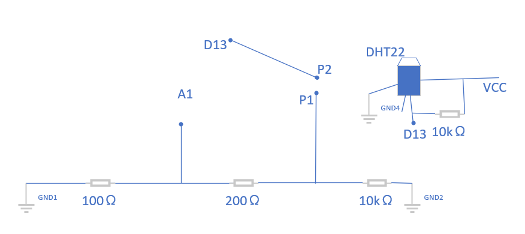
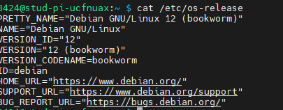
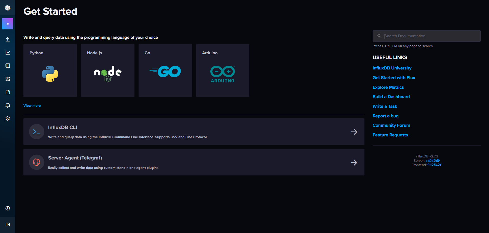

# Plant Monitor

## Overview

This document documents how to make a plant monitor under the [workshop guidance](https://workshops.cetools.org/codelabs/CASA0014-2-Plant-Monitor/index.html) of the course CASA0014. The plant monitor will monitor soil moisture and environment conditions(temperature and moisture), send data to an MQTT server and send email to yourself when the environment conditions are not good.

## Catalog

1. [Physical Equipment](#PE)
2. [IDE](#IDE)
3. [Arduino Library](#AL)
4. [Process](#Pro)
5. [future](#future)

****

## <a name="PE"> </a>1. Physical Equipment

*  ***Feather Huzzah ESP8266 Wifi***  &times; 1
* ***circuit board***  &times; 1
* ***nail*** &times; 2
* ***resistances***:
  * ***10kΩ*** &times; 2
  * ***100Ω*** &times; 1
  * ***200Ω*** &times; 1
* ***DHT22 sensor***  &times; 1
* ***Cable*** &times; 1
* ***Raspberry Pi*** &times; 1
*  ***Micro usb to usb-b cable*** &times; 1
* ***Plant*** &times; 1

****

## <a name="IDE"> </a>2. IDE

* ***Arduino IDE***
* ***Visual Studio Code***
* ***MobaXterm***
* ***IntelliJ IDEA***

****

## <a name="AL"> </a>3. Arduino Library

In this section you can use the library manager of IDE to find them or download it from official.

* ***ESP8266WiFi***
* ***ESP8266WebServer***
* ***ezTime***
* ***PubSubClient***
* ***DHT  from Adafruit***
* ***DHT_U from Adafruit***

****

## <a name="Pro"> </a>4. Process

In this section, it will briefly show how to build this plant monitor

 ### 4.1. Connect Feather Huzzah ESP8266 Wifi to MQTT

#### 4.1.1 Assemble the circuit

The sketch below shows the outline design for v2 of the circuit 



Here is the finished product:


*Notice:* Some places need to be soldered

#### 4.1.2 Setup Arduino

You need to create a header file named `secrets.h` to contain your WIFI and MQTT information. The format shows as below:

```C++
#define SECRET_SSID "xxx"
#define SECRET_PASS "xxx"
#define SECRET_MQTTUSER "xxx"
#define SECRET_MQTTPASS "xxx"
```

Then, in  `sketch_oct23b.ino`  code, you can reference these keys to connect to WIFI and the MQTT server. Here's an easy example of how to connect to WIFI: 

```c++
#include "arduino_secrets.h"
const char* ssid = SECRET_SSID;
const char* password = SECRET_PASS;
```
```c++
void setup(){
...
startWifi();
...
}
```
```c++
void startWifi() {//function which is put in the setup() to connect to WIFI
  //print connection information
  Serial.println();
  Serial.print("Connecting to ");
  Serial.println(ssid);

  WiFi.begin(ssid, password);  //insert wifi ssid and password to start to connect to

  while (WiFi.status() != WL_CONNECTED) {
    delay(500);
    Serial.print(".");  //show connecting message
  }
  Serial.println("");

  //print successfully connecting WIFI message
  Serial.println("WiFi connected");
  Serial.print("IP address: ");
  Serial.println(WiFi.localIP());
}
```

 You can see Other code and explanations in the  **`sketch_oct23b.ino`**  where there are detailed annotations, so I won't go into details here.

Also the code of each function part , like connecting Wifi and connecting MQTT server, you can see examples in `example` folder.

#### 4.1.3 Setup Raspberry Pi

* First follow the [tutorial](https://www.tomshardware.com/reviews/raspberry-pi-headless-setup-how-to,6028.html) to burn your Raspberry pi SD card.

*  Once the card is flashed, insert it into the RPi and power it up and log into the device using SSH. In my case I used: 

	```
	ssh pi@stud-pi-ucfnuax.local
	```

	*Notice:* if the terminal reports:

	```
	ssh: Could not resolve hostname .....
	```
	
	​	Maybe deleting the `.local` will help you.
	
* Check the OS your device by using:

  ```
  cat /etc/os-release
  ```

  my results show like this:

  

*  Do a quick update / upgrade to make sure all files are upto date and then reboot before moving on to installing the datastore:

  ```
  sudo apt update
  sudo apt upgrade -y
  sudo reboot
  ```

* Follow the [*guidance*](https://workshops.cetools.org/codelabs/CASA0014-2-Plant-Monitor/index.html?index=..%2F..index#11) and install InfluxDB, Telegraf and Grafana, here are some results:

  
  
  
  
  
  
  
  
  

#### 4.1.4 Setup SpringBoot

Spring Boot acts as an MQTT consumer. When the Spring Boot server receives a message from the MQTT server, it checks the data to determine if the plant's environmental conditions are adequate. It then sets up a web page to display the maximum and minimum values for three data items over the past 10 minutes.  

The file placement and name structure typically refers to Java EE.

* Connect to MQTT Server:

  Use MQTT server to monitor  the data of environment conditions of your plant.

  *  You can use the configured `MqttClient` bean to connect MQTT Server.  

  * dependency:

    ```
    <dependency>
    	<groupId>org.springframework.integration</groupId>
    	<artifactId>spring-integration-mqtt</artifactId>
    </dependency>
    ```

  * Then add your own information and try to connect MQT .  You can connect to `MQTTClient` in your Java application by referring [Official document](https://eclipse.dev/paho/files/javadoc/org/eclipse/paho/client/mqttv3/MqttClient.html): 

* Send warning email

  Automatically send an email to you to warn you that the environment conditions of your plant are not good:
  
  * Logic(pseudo-code):
  
    ```pseudocode
    get data from MQTT server;
    boolean flag = judge if data can meet the requirements
    //requirements: 40<humidity<60 15<temperature<24 20<humidity<75
    if(!flag){
    	send_email();
    }
    ```
  
  
  * You can use the configured `JavaMailSender` bean to send emails in your application. 
  * dependency:
  
  ```
  <dependency>
  	<groupId>org.springframework.boot</groupId>
  	<artifactId>spring-boot-starter-mail</artifactId>
  </dependency>
  ```
  
  *  You can send emails based on your project's specific email sending requirements by referring [Official document](https://docs.spring.io/spring-framework/reference/integration/email.html)
  *  
  
* Check recent maximum and minimum values
  
  I create a static html document `test.html` and put it in`/src/main/resources/static` to get the maximum and minimum values of 10 latest humidity, temperature and moisture.
  
  * In order to use URL to access `test.html`, you need to complete `WebMvcConfigurer` configuration and ` Cross-Domain ` configuration. The details you can see my `corsConfig` and `WebConfig` files.
  * 

****

## <a name="future"> </a>5. Future work

1. Direct feedback
   * add some LEDs to show the situation of plant. When it is good enough, LEDs will not blink while when the situation is worse and worse, the link rate will accelerate.
   *  prevent led lights from flashing to prevent people from having a good rest in the evening.
   * add LCD to monitor the HP(health point) of plant. When it is suffering the bad environment situations, the HP will be lower and lower. When the HP comes to a threshold, the buzzer will make sound to notice users to watch out their plants.
2. Better and More Spring Boot server
   * give the user interfaces so that they can customize something, such as the warning email, and values they want to see in the html.
   * add more functions for example, show the data in a diagram, video monitor.


